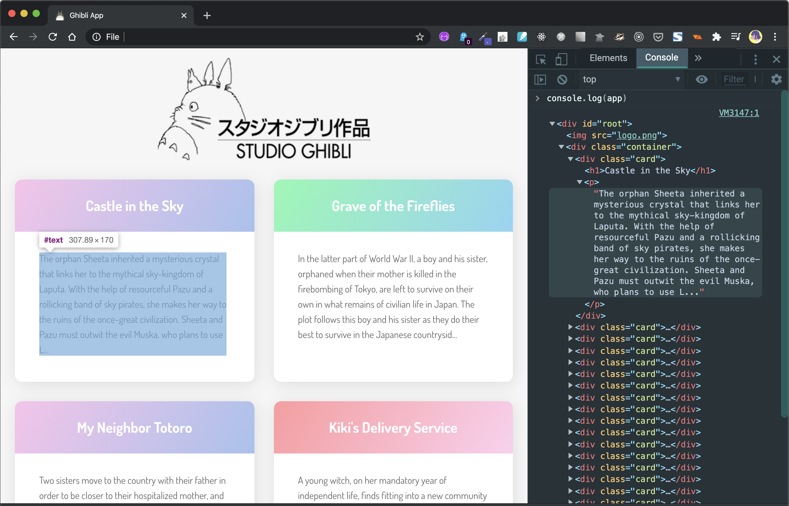

# API with JavaScript | Ghibli App
A plain JavaScript to connect to the API using HTTP requests

## Demo



## Quick overview

**API** stands for Application Program Interface, which can be defined as a set of methods of communication between various software components. In other words, an API allows software to communicate with another software.

We'll be focusing specifically on Web APIs, which allow a web server to interact with third-party software. In this case, the web server is using HTTP requests to communicate to a publicly available URL endpoint containing JSON data. If this is confusing now, it will make sense by the end of the article.

You may be familiar with the concept of a `CRUD` app, which stands for `Create, Read, Update, Delete`. Any programming language can be used to make a CRUD app with various methods. A web API uses HTTP requests that correspond to the CRUD verbs.


| Action  | HTTP Method   | Description                  |
| --------|:-------------:| ----------------------------:|
| **Create**  | `POST`        | Creates a new resource       |
| **Read**    | `GET`         | Retrieves a resource         |
| **Update**  | `PUT`/`PATCH` | Updates an existing resource |
| **Delete**  | `DELETE`      | Deletes a resource           |


> If you've heard REST and RESTful APIs, that is simply referring to a set of standards that conform to a specific architectural style. Most web apps do, or aim to conform to REST standards. Overall, there are a lot of terms, acronyms and concepts to understand - HTTP, API, REST - so it's normal to feel confused and frustrated, especially when API documentation assumes you already know what to do.


## Connecting to the API

Let's take a look at the [Studio Ghibli API documentation](https://ghibliapi.herokuapp.com/). This API was created to help developers learn how to interact with resources using HTTP requests. Since an API can be accessed by many different methods - JavaScript, PHP, Ruby, Python and so on - the documentation for most APIs doesn't tend to give specific instructions for how to connect.


## Retrieving the data with an HTTP request

Before we try to put anything on the front end of the website, let's open a connection the API. We'll do so using `XMLHttpRequest` objects, which is a way to open files and make an HTTP request.

We'll create a `request` variable and assign a new `XMLHttpRequest` object to it. Then we'll open a new connection with the `open()` method - in the arguments we'll specify the type of request as `GET` as well as the URL of the API endpoint. The request completes and we can access the data inside the `onload` function. When we're done, we'll send the request.

```javascript
// Create a request variable and assign a new XMLHttpRequest object to it.
var request = new XMLHttpRequest()

// Open a new connection, using the GET request on the URL endpoint
request.open('GET', 'https://ghibliapi.herokuapp.com/films', true)

request.onload = function() {
  // Begin accessing JSON data here
}

// Send request
request.send()
```

## Working with the JSON response

Now we've received a response from our HTTP request, and we can work with it. However, the response is in JSON, and we need to convert that `JSON` in to `JavaScript` objects in order to work with it.

We're going to use `JSON.parse()` to parse the response, and create a data variable that contains all the `JSON` as an array of `JavaScript objects`. Using `forEach()`, we'll console log out the title of each film to ensure it's working properly.

```javascript
// Begin accessing JSON data here
var data = JSON.parse(this.response)

data.forEach(movie => {
  // Log each movie's title
  console.log(movie.title)
})
```
Using Inspect on index.html and viewing the console, you should see the titles of 20 Ghibli films. **Success!**